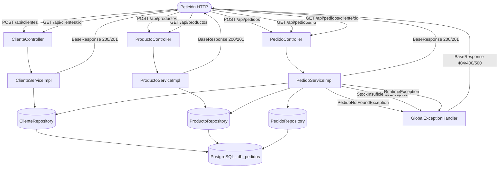
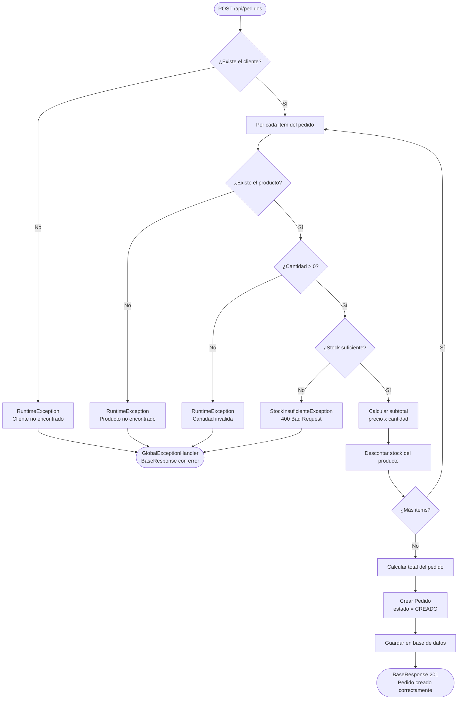

## API REST de Gestión de Pedidos

Alumno: Johan Alexis Alfaro Mejia

Proyecto Maven con Spring Boot que permite registrar clientes, productos y crear pedidos. Cada pedido puede tener varios productos (relación uno a muchos).

## Tecnologías

Java 21, Spring Boot 3.3.0, Maven, PostgreSQL, Spring Data JPA, Lombok, JUnit 5, Mockito

## Configuración de base de datos

Crear la base de datos en PostgreSQL:

    CREATE DATABASE db_pedidos;

Las credenciales van en application.properties (usuario: postgres, contraseña: admin).

## Cómo ejecutar

    mvn clean install
    mvn spring-boot:run

La aplicación corre en http://localhost:8085

## Endpoints

    POST   /api/clientes
    GET    /api/clientes/{id}
    POST   /api/productos
    GET    /api/productos
    POST   /api/pedidos
    GET    /api/pedidos/{id}
    GET    /api/pedidos/cliente/{clienteId}

## Diagrama de flujo del sistema

## Flujo de creación de pedido

## Ejemplos de uso

Crear cliente:

    POST /api/clientes
    {
      "nombre": "Juan",
      "apellido": "Perez",
      "dni": "12345678",
      "correo": "juan.perez@gmail.com"
    }

Crear producto:

    POST /api/productos
    {
      "nombre": "Teclado mecanico",
      "descripcion": "Teclado RGB",
      "precio": 150.00,
      "stock": 20
    }

Crear pedido:

    POST /api/pedidos
    {
      "clienteId": 1,
      "items": [
        { "productoId": 1, "cantidad": 2 },
        { "productoId": 2, "cantidad": 1 }
      ]
    }
